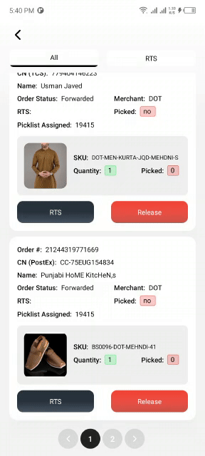
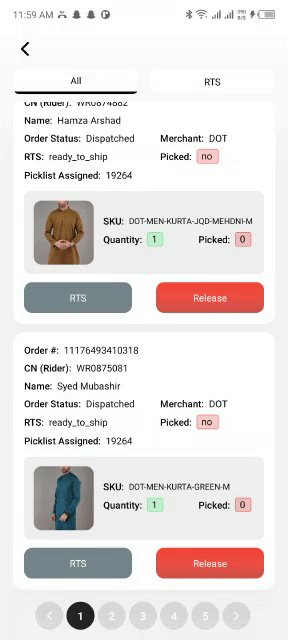

# React Native Custom Pagination

### Default Examples Layout

> To try these out yourself its prudy easy, Just open `examples/ios/*.xcodeproj` in Xcode, then press `Cmd + R`; you may edit `examples/index.ios.js` for switch cases.

<p align="center">

 
  
</p>

## Installation

- Install `react-native` first

```bash
$ yarn add react-native-custom-pagination
$ cd ReactNativePaginationExample
$ yarn install #(or with npm "npm i react-native-pagination —save")
$ react-native run-ios
```

- Initialization of a react-native project

```bash
$ react-native init myReactNativePaginationExample
$ cd myReactNativePaginationExample
$ yarn install #(or with npm "npm i && npm i react-native-custom-pagination —save")
$ yarn add react-native-custom-pagination
$ react-native link
$ react-native run-ios
```

### Development

in your project

```bash
$ yarn add react-native-custom-pagination
$ react-native link #this makes sure react-native-feather load correctly
$ react-native run-ios
```

## Basic Usage

- In your `myApp/App.js`, use:

```jsx
import {
  View,
  Text,
  StyleSheet,
  Pressable,
  FlatList,
  SafeAreaView,
} from "react-native";
import React, { useState } from "react";
import Pagination from "react-native-custom-pagination";

export default function MyPaginationComponent() {
  return (
    <Pagination
      setPage={setPage} // setPage will be managed here
      activePage={page} // active will be show here
      totalPages={totalPages} // use calculated total pages here
      active={{ backgroundColor: "#000000" }} // use any color in you case
      inactive={{ backgroundColor: "rgba(0,0,0,0.1)" }} // use any color in you case
      pressAbleButtonStyles={{ backgroundColor: "rgba(0,0,0,0.1) " }} // use any color in you case
    />
  );
}
```

#### Basic Props

| Prop                  | Default                              | Type     | Description                            |
| --------------------- | ------------------------------------ | -------- | -------------------------------------- |
| setPage               | `[]`                                 | `number` | you will set page here Items           |
| activePage            | `[]`                                 | `number` | active pages will apear here           |
| totalPages            | `[]`                                 | `number` | caluculated pages will be here         |
| active                | `backgroundColor: '#000000'`         | `color`  | use your active color in this case     |
| inactive              | `backgroundColor: 'rgba(0,0,0,0.1)'` | `color`  | use you inactive color herw            |
| pressAbleButtonStyles | `{{}}`                               | `style`  | you can use your own style here Styles |

## Issues

Feel free to [contact me](mailto:ibilalchaudhary@gmail,com) or [create an issue](https://github.com/ibilalchaudhary/react-native-custom-pagination/issues/new)
